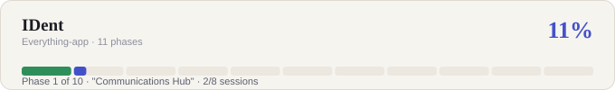

# IDent

**Walk out the door with nothing but yourself — and if "yourself" is all you
have, you can still get in.**

IDent's mission: let a person walk, travel, and commute without carrying a
wallet, a set of keys, or a folder of documents. Your identity — documents,
door/car keys, payment, and the whereabouts of what you're carrying — lives
under one self-chosen username and password, not tied to a phone number, and
travels with you on a device (and eventually a biometric) instead of in your
pockets. And for the moments a phone or laptop isn't an option either —
lost, dead, left behind — the same identity should still be reachable from
an alternative access point, without that access point ever holding onto
your keys once the session ends.

> **Status: Phase 0 (Identity Core) done, Phase 1 (Communications Hub) in
> progress.** Real username+password accounts, passkeys, recovery codes,
> and step-up auth are all built and browser-verified; Phase 1's schema
> foundation, real Gmail OAuth/sync, the protected unified inbox UI, and
> derived contact cards are in. The
> progress bar above is regenerated after each session
> (`scripts/generate-progress-svg.mjs`) — see
> [IDent_STATE.md](IDent_STATE.md) for exactly what's done vs. pending in
> detail, and [DEVELOPMENT.md](DEVELOPMENT.md) to run it locally.

## Why

Leaving the house today still means patting your pockets for three physical
things: a wallet (payment + ID), a set of keys (home, car, office), and
sometimes a folder of documents (for an appointment, a border crossing, an
enrollment office). Each of those is solvable with a phone already — Apple
Pay replaces the wallet, digital car keys exist, ID wallets are emerging —
but they're scattered across separate apps and vendors with no single owner.
IDent's goal is to be the one place all three live, under a single
user-owned identity, with the understanding that the modules carrying the
most sensitive data (identity documents, health, finance, biometrics, door
keys) need materially stronger isolation and compliance handling than the
modules carrying the least (music, news, gaming profile). Everything else in
this repo — comms hub, productivity, health, personal data — exists around
that core mission, not instead of it.

## Documents

| Doc | Purpose |
|---|---|
| [ROADMAP.md](ROADMAP.md) | Phased delivery plan across all modules, in build order |
| [ARCHITECTURE.md](ARCHITECTURE.md) | System design: identity core, API layer, module boundaries, integrations |
| [SECURITY.md](SECURITY.md) | Threat model, encryption approach, and compliance load per module |
| [BOOTSTRAP.md](BOOTSTRAP.md) | Whether this is buildable without capital, and the paid-private-assistant monetization model |
| [OPERATIONS.md](OPERATIONS.md) | The Founder Attention Budget, the OPERATE-0…7 automation checklist, and the `IDent_STATE.md` resumability contract |
| [IDent_STATE.md](IDent_STATE.md) | Living status file — current phase, what's actually done vs. pending, next tasks. Read this before writing any code. |
| [DEVELOPMENT.md](DEVELOPMENT.md) | How to run the current scaffold locally |

## Module map

- **Identity Core** — username/password identity, biometric enrollment, session & key management
- **Communications Hub** — unified inbox (messages, notifications), contact cards, voice/video calling across networks, Slack
- **Productivity** — calendar, reminders, Notion, drive data, personal/virtual storage
- **Documents & Credentials Vault** — government ID, passport, driving license, enrollment letter, transcript, CV, LinkedIn
- **Educational Profile** — full education history from day zero (every school/program attended) plus a living record of skills acquired over time
- **Health Profile** — blood tests and records structured for clinician access
- **Finance** — bank accounts, investments/stocks, biometric payment authorization (pay in-store/online with a fingerprint or face match instead of a card or PIN)
- **Devices & Physical World** — remote device piloting, device location, digital keys (home/car/office door unlock from your phone instead of a physical key), belongings tracking (find a bag or item, not just a device), QR/Bluetooth/AirDrop sharing
- **Life Logistics** — transportation booking, shipment tracking, addresses, location features
- **Personal & Discovery** — music, gaming profile, news, research profile, browsing data
- **Deviceless / Alternative Access** — reach your data and high-trust actions (vault, digital keys, biometric payment) from a public terminal or borrowed device when you have no phone or laptop of your own, without leaving anything behind on that device
- **Telecommunications** *(longest-horizon, explicitly gated — see ROADMAP.md Phase 10)* — `@username` as a communications identity that resolves to whatever channel is live, starting from IDent-to-IDent VoIP and, only much later and only if earlier phases are stable and profitable, progressing through eSIM reseller and MVNO stages
- **AI Assistant Layer** — cross-cutting assistant with scoped access to the above

Full sequencing and rationale for this ordering is in [ROADMAP.md](ROADMAP.md).

### Notifications (session 20)

Notifications from third-party services land in the same unified inbox as
mail, discriminated by `kind`.

| Route | Purpose |
| --- | --- |
| `GET /identity/notifications/endpoint` | Status only — never the token |
| `POST /identity/notifications/endpoint` | Mint or rotate; returns the plaintext **once** |
| `POST /notifications/ingest` | Where a service posts, token in the `x-ident-notification-token` header |
| `POST /notifications/ingest/:token` | URL fallback for senders that cannot set headers; the path is redacted in logs |
| `GET /identity/messages?kind=notification` | Segment the unified list |

Only the sha256 hash of the token is stored, so a database dump yields no
usable credential and a lost token can only be replaced, not recovered.
`actionUrl` is validated to http/https at ingest — a `javascript:` URL
rendered as a link is stored XSS.

The ingest endpoint answers **202 to everything** — unknown token, valid
delivery, malformed payload — so it cannot be used to test whether a token
is live. Rejections are recorded against the endpoint for the owner to
read, which is how a misconfigured sender stays debuggable without
telling the sender anything.
